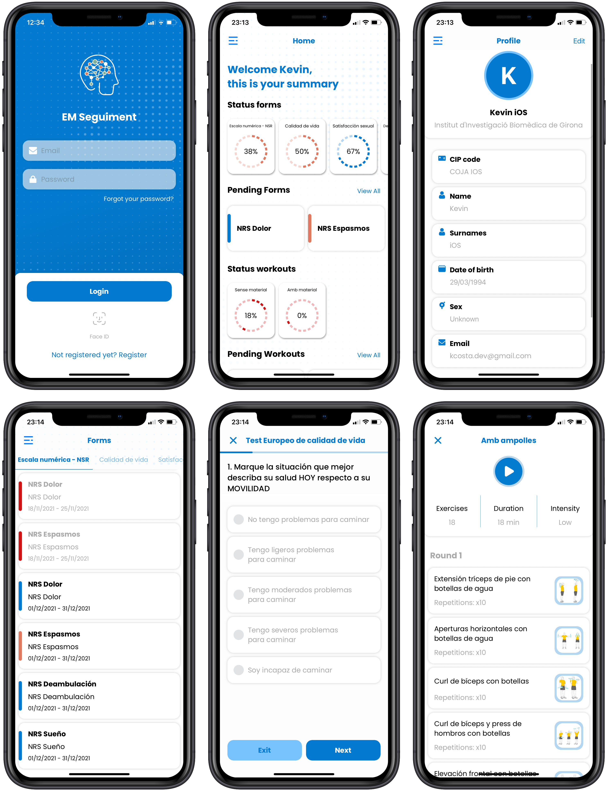
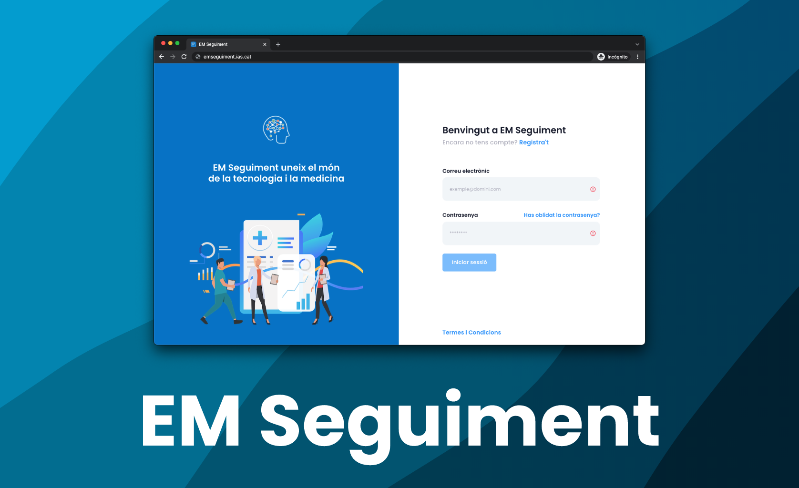

# EM Seguiment

 

 

EM Seguiment is a platform for iOS, Android and Web to help medical teams to improve the health care of their patients.

- [Introduction](#introduction)
- [Platforms](#platforms)
    - [Mobile platform (iOS and Android)](#mobile-platform-ios-and-android)
    - [Web platform (Angular)](#web-platform-angular)
    - [Backend (Spring Boot and MySQL)](#backend-spring-boot-and-mysql)
- [Functionality](#functionality)
- [Used technology](#used-technology)
- [Screenshots](#screenshots)
- [Demo](#demo)

## Introduction

Neurology is a constantly evolving medical specialty that is nurtured of new technologies to improve patients quality of life. MS is a chronic disease of central nervous system, of unknown etiology and autoimmune mechanism in which two pathogenic processes, inflammation and neurodegeneration, converge giving rise to a progressive course disorder with a high degree of both physical and cognitive disability. In this disease, it is the vital importance of collecting data in a homogeneous and structured way from patients to assist in decision making before, during and after the visit and treatment.

EM Seguiment is the health care solution that allows to optimize public resources of the health and provide better care to people who suffer this disease with more personal attention. This platform allows a medical team to keep a better track of the state of the disease and allows them to assign forms and workouts specifically to each patient to improve their health status. With this they will give a more specific and personal attention to the patients, because this disease is different in each person.

Nowadays, this project is ready to deploy in the servers of **[Girona Biomedical Research Institute](https://idibgi.org)** working with **[University Hospital of Girona Dr. Josep Trueta](https://icsgirona.cat/ca/hospitaltruet)**.

## Platforms

EM Seguiment is a platform that is based in three different fields.

### Mobile platform (iOS and Android)

A mobile application, only for patients, developed with Swift 5 and Kotlin. Implements different library to add more feature like push notifications with [OneSignal](https://onesignal.com), [Flurry](https://www.flurry.com) (to track the user interaction with the application), [Lottie](https://lottiefiles.com) for animations and among others. Using an API, you can send and retrieve data from the backend. The minium **SDK for Android is 23** and the minium **iOS version is 12.0**.

On the mobile platform, patients, they will be able to:
- Update profile
- Receive push notifications
- List and do workouts
- List and do forms

### Web platform (Angular)

A web application for medical team implemented by Angular framework and developed in [TypeScript](https://www.typescriptlang.org) using HTML5 and CSS. This CMS allows doctors to assign tasks and rehabilitation workouts to patients.

On the web platform, doctors, they will be able to:
- Manage other doctors (CRUD).
- Validate doctors.
- Manage patients (CRUD).
- Validate patients.
- Assign workouts to patients.
- Assign forms to patients.

### Backend (Spring Boot and MySQL)

Backend implemented with [Spring Boot](https://spring.io) developed with Kotlin. This backend manages the communication between mobile and web platform with the database with a simple and clever API. Used [JWT](https://jwt.io), SSL and encryption for a secure communication. And [MySQL](https://www.mysql.com) for storing all the collected data. This backend has the responsibility to send push notifications to each device of the patients, and send emails like recovery password or new register.

This backend:
- Send automated push notifications.
- Send automated emails.
- Create backups of the data.
- Manage data.

## Functionality

1. The functionality is simple, a doctor accesses the web app and assigns new forms or workouts to patients with a start and end date. Patients will be notified by push notification advising them they have a new assignment.

2. Patients access the mobile app and list all the assignments they have and they do before the and date. When patients finish one of the assignments, they send the results to the backend.

3. Doctors list all the assignments (forms and workouts) of patients and if the assignment is finished, they will be able to see the results.

## Used technology
This the of the used technology depend of the platform. There are some library that no mention.
| Android | iOS | Web App | Backend |
| ----------- | ----------- | -- | -- |
| Kotlin | Swift 5 | Angular 12.2.3 | Kotlin |
| OneSignal | OneSignal | Node 14.17.6 | JWT |
| Flurry | Flurry | TypeScript | Thymeleaf |
| Lottie | Lottie | HTML | MVC |
| MVC | CocoaPods | CSS | MySQL |
| DB Room | CoreData |  | SSL Certificate |
|  | MVC | | |

## Screenshots

## Demo

Quick demo of the iOS application and the functionality in [YouTube](https://youtu.be/0PZZ-AEs1hQ).

Quick demo of Web Application and iOS and the functionality in [YouTube](https://youtu.be/oJqA9zT5YSA).

**Copyright © 2021 Kevin Costa. All rights reserved.**